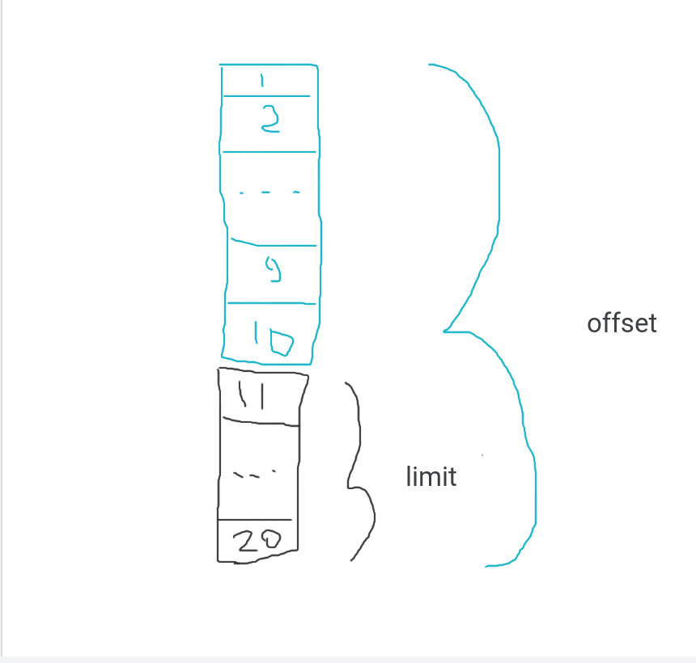
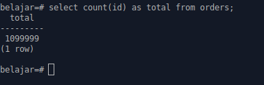
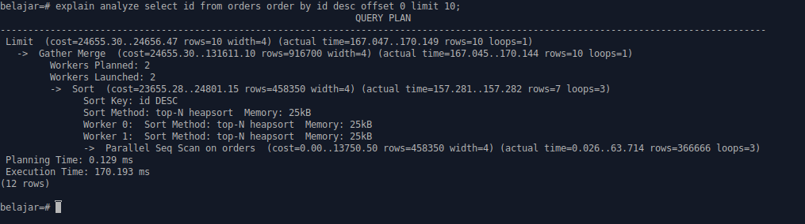
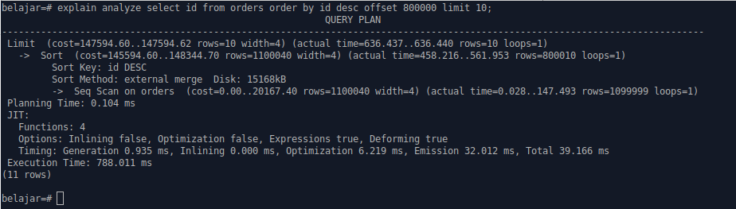
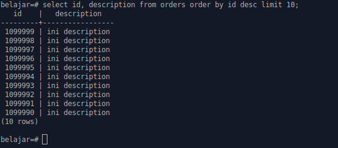
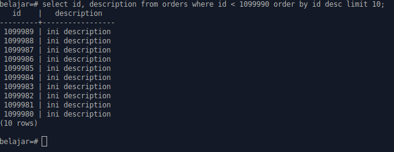
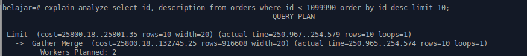
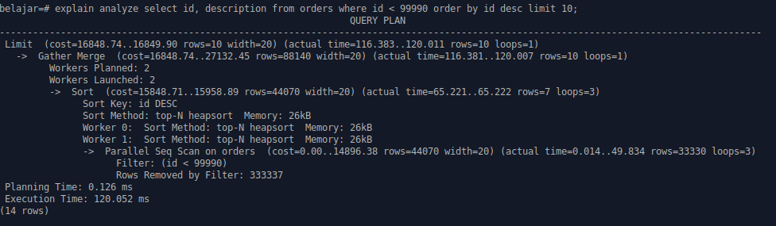

Terkadang pagination yang kita buat memiliki response yang lambat ketika data yang tersimpan di database sudah semakin banyak. Bila kasus seperti ini terjadi mungkin artikel ini cocok untuk anda.

Sering kali kita menggunakan offset dan limit untuk membuat pagination sebagai contoh query page ke 9 dengan list data 10.

``` sql
SELECT id FROM order OFFSET  80 LIMIT  10
```

Mungkin ketika jumlah data baru ratusan atau ribuan hal ini mungkin tidak akan menjadi masalah, lalu bagai mana ketika data yang kita punya berjumlah jutaan atau lebih?, tentu hal ini akan memperngaruhi di performa. Why? 



Jika dilihat dari cara kerja offset, offset tetap membaca index pertama dan menghapus (drop) data, dalam contoh kasus misal `OFFSET 80`, offset tetap membaca data dari index pertama sampai 90 lalu menghapus (drop) 80 data pertama dan menyisakan 10 (limit).

Kasus lain misal disini saya memiliki lebih dari 1.000.000 (satu juta) data



Untuk melihat proses yang terjadi kita menggunakan query `explain analyze` . pertama kita set offset dengan nilai 0

``` sql
explain analyze select id from orders order by id desc OFFSET 0 LIMIT 10
```

Query di atas akan menghasilkan output sebagai berikut :



Dapat dilihat pada `Gather Merge  (cost=24655.30..131611.10 rows=916700 width=4) (actual time=167.045..170.144 rows=10 loops=1)` kita mendapat actual rows yang di ambil sejumlah 10, ya ini sangat bagus mengingat kita hanya membutuhkan 10 baris saja. 

--- 

Lalu bagai mana kalau kita mengganti nilai offset ke 800.000 (delapan ratus ribu) ? mari kita coba

``` sql
explain analyze select id from orders order by id desc OFFSET 800000 LIMIT 10
```

Query di atas akan menghasilkan output sebagai berikut :



Dapat dilihat hasilnya pada `Sort  (cost=145594.60..148344.70 rows=1100040 width=4) (actual time=458.216..561.953 rows=800010 loops=1)` , kita mendapat actual rows yang di ambil sejumlah 800010 (delapan ratus ribu sepuluh) padahal kita hanya membutuhkan 10 rows data saja, ini akan membuat waktu prosesnya menjadi lebih lama ( sebagai contoh di atas `788.011 ms` ).

> point utamanya adalah offset hanya membutuhkan satu parameter, yaitu nomor dari rows yang akan dihapus.

Lalu gimana solusinya ?

Solusinya sebenarnya kita cukup menggunakan last index, misal kita jalankan query 

``` sql
select id, description from orders limit 10
```

Query diatas akan menghasilkan output



Dapat dilihat last rows yang yang kita dapat `1099990` setelah kita mendapat last index ini, kita cukup menggunakan query `where`, querynya jadi seperti ini :

``` sql 
select id, description from orders where id < 1099990 limit 10
```

Query di atas akan menghasilkan output :



Dapat dilihat hasil dari query diatas mirip ketika kita menggunakan `offset`, lalu gimana kalau kita tambahin `explain analyze`

``` sql
explain analyze select id, description from orders where id < 1099990 limit 10
```

Query di atas akan menghasilkan output :



Dapat dilihat actual rows yang diambil hanya 10, kita coba buat query yang setara dengan `offset 1000000` (satu juta) 

``` sql
explain analyze select id, description from orders where id < 99990 limit 10
```

Query di atas akan menghasilkan output :



Dapat dilihat pada `Gather Merge  (cost=16848.74..27132.45 rows=88140 width=20) (actual time=116.381..120.007 rows=10 loops=1)` actual rows yang diambil hanya sejumlah 10 ini sesuai dengan jumlah yang kita butuhkan. dan perbandingan waktu prosesnya juga cukup jauh bedanya, proses diatas medapat waktu `120.052 ms` , jika menggunakan `offset 80000` tadi kita mendapat waktu `788.011 ms`. 

##### Reference
[https://use-the-index-luke.com/no-offset](https://use-the-index-luke.com/no-offset)