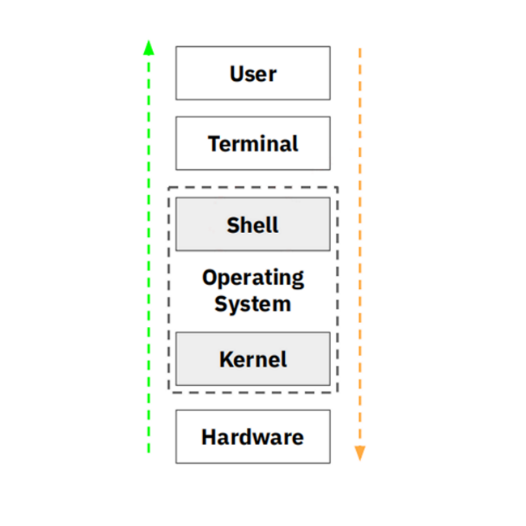
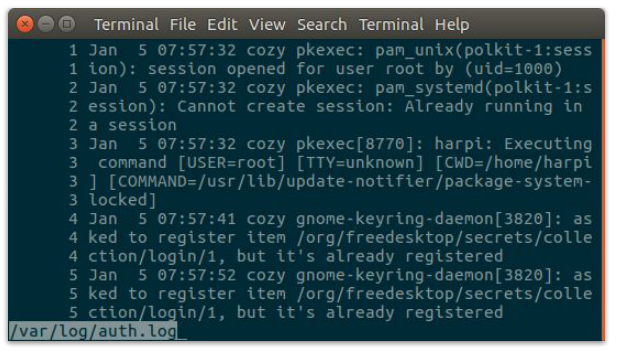

## What is a Shell?
Shell merupakan interface sistem operasi yang bertindak sebagai command 
interpreter yang mengambil setiap perintah yang kita inputkan untuk 
diberikan kepada sistem operasi untuk dijalankan sehingga 
mengembalikan hasil operasi ke layar (Terminal).

<p>

</p>
<center><i>Shell</a></i></center>

### Jenis-Jenis Shell
* **Bourne shell (sh)**<br/>
Bourne Shell adalah shell standar Unix yang dibuat pada tahun 1979 oleh Stephen Bourne dari AT&T yang dibuat dengan bahasa pemrograman Algol. Bourne Shell terkenal karena sederhana, compact, and cepat. Kelemahannya adalah kurang interkatif seperti tidak ada history, aliasing, dan job control. Default prompt Bourne Shell adalah `$` (dolar).

* **C shell (csh)**<br/>
C Shell atau csh memiliki feature yg lebih lengkap dibandingkan Bourne Shell. Shell ini dibuat tahun 1970an oleh Bill Joy menggunakan bahasa C. Fitur yang terdapat dalam csh antara lain command-line history, aliasing, built-in arithmetic, filename completion, & job control. Kelemahnnya adalah shell ini cenderung lambat bila digunakan pada mesin kecil dikarenakan shell ini didesain untuk mesin yang besar dengan fitur yang lengkap. Default prompt C Shell adalah `%` (persen).

* **TC shell (tcsh)**<br/>
TC Shell adalah versi lanjutan dari C Shell. Shell ini dikembangkan oleh Ken Greer pada pada akhir 1970an di Carnegie Mellon University. Shell ini fitur seperti Command-line Editor, Code-completion, Spelling Correction  History Mechanism dan Job Control. Default prompt TC Shell adalah `%` (persen).

* **Bourne Again Shell (bash)**<br/>
Bourne Again Shell adalah default shell Linux yang merupakan pengembangan dari bourne shell sehingga kompatibel juga di Unix. Shell ini dibuat pada tahun 1988 oleh Brian Fox dari FSF (Free Software Foundation) GNU. Beberapa fitur yang dimiliki bash antara lain interaktif, dapat membuat shortcut, bisa berwarna, dll. Selain itu shell bash juga menggabungkan fitur fitur yang ada pada shelll sh, csh, dan ksh. Default Bash prompt adalah `$` (dolar).

<p>

</p>
<center><i>Fitur dari beberapa shell</a></i></center>

## What is a Shell Prompt?
Shell Prompt adalah tempat dimana kita mengetikan perintah atau paling sering kita menyebutnya CLI (command line interface). Bagian-bagian dari Bash Shell adalah sebagai berikut

### Command Line
Command Line adalah tempat dimana kita menuliskan perintah untuk menjalankan shell. Contoh penulisan perintah
```
command -options <filename>
```
<br/>

### Shell Prompt
Adalah sebuah tanda pada layar dimana akan menunjukan command line harus ditempatkan. Pada bash shell prompt defaultny adalah tanda dollar `$`
```
[username@localhost.localdomain username]:~$
```

### Shell
Adalah sebuah program yang bertindak sebagai interpreter/penerjemah sehingga sistem operasi mengetahui maksud dari perintah user.

### Terminal Window
Sebuah window yang menampung **Shell Prompt**,**Command Line**, dan output dari **Shell**.

<p>

</p>
<center><i>Contoh penulisan bash shell</a></i></center>

## Why CLI not GUI?
### CLI
1. **Dapat melakukan banyak hal dalam skala besar**. Perintah sederhana pada CLI dapat dengan mudah mengubah konfigurasi dalam skala besar dalam satu waktu.
2. **Terkadang membutuhkan automasi script**
3. **Kamu dapat memiliki akses ke semua fungsi sistem**
4. **Menggunakan NPM, Gems, pip, composser untuk menginstall package** dapat dengan mudah dilakukan dan tools tersebut sangat populer dikalangan developer yang mana tidak memerlukan GUI.
5. **Dapat menggunakan Version Control Git**.
6. **Tidak memakan memory yang besar**.

### GUI
1. **To reduce mental work**. Terkadang kita akan bosan juga dengan tampilan baris-baris perintah pada CLI. GUI menawarkan visualisasi yang lebih baik dan terasa lebih simpel untuk mengelola pekerjaan.
2. **Simplify the structure of tasks**. Pekerjaan akan selesai tanpa perlu berkutik dengan baris kode. Menulis kode juga berdampak typo hingga kamu akan menemukan error dan akan menghabiskan waktu.
3. **Make results visible**. Kamu akan dapat melihat respon sistem yang lebih bersih dan dan dapat dengan mudah mengenali error ketika sedang melakukan debugging.
4. **Make the barrier of entry lower**. Karena penggunaanya yang simpel dan mudah, GUI banyak digunakan oleh sebagian besar pengguna komputer terlebih lagi pengguna komputer yang masih awam dan baru belajar.

## How to interact with Shell?
Untuk berinteraksi dengan Shell kamu perlu menggunakan *Terminal emulator*, program ini yang dapat menjadikan user dapat berinteraksi dengan shell. Beberapa jenis terminal emulator yang bisa digunakan antara lain
* gnome-terminal
* konsole
* xterm
* rxvt
* kvt
* nxterm dan eterm

<p>

</p>
<center><i>Gnome Terminal</a></i></center>

## Shell Prompt Basics

**1. alias - command**<br/>
Alias biasanya digunakan untuk menyingkat suatu perintah yang panjang.

**Command** 
```
alias nama_alias=perintah
```
**Contoh** 
```
$ alias cls=clear 
$ alias showme="ls -l"
```
<p>

</p>


**2. man - an interface to the on-line reference manuals**<br/>
Berfungsi untuk menampilkan dokumentasi atau manual suatu perintah.

**Command** 
```
man [command]
```
**Contoh** 
```
 $ man ls 
 $ man mkdir
 $ man rm
```
<p>

</p>

**3. history - GNU History Library**<br/>
History digunakan untuk menampilkan kembali perintah-perintah yang sudah diketikkan dari prompt dengan cara menekan tombol panah atas atau tombol panah bawah.

**Command** 
```
history
```
**Contoh** 
```
$ history
```
<p>

</p>

**4. ls - list directory contents**<br/>
Digunakan untuk menampilkan isi sebuah direktori. Pilihan yang sering digunakan

**Command** 
```
ls [OPTION]... [FILE]...
```
**Contoh** 
```
 $ ls
 $ ls -l
 $ ls -la
```
```
[OPTION]: 
-a # menampilkan seluruh isi direktori termasuk file yang hidden
-d # menampilkan atribut direktori bukan isinya
-l # menampilkan isi direktori lengkap dengan atributnya
-R # menampilkan isi subdirektori
```
<p>

</p>

**5. passwd - change user password**<br/>
Untuk mengubah password user, normal user hanya bisa mengubah miliknya sendiri, sementara superuser bisa  mengubah user lain

**Command** 
```
passwd
```
**Contoh** 
```
 $ passwd [Enter] 
 Changing password for harpi
 (current) UNIX password:
 New UNIX password: 
 Retype new UNIX password:
 passwd: password updated successfully
```
<p>

</p>

**6. more - file perusal filter for crt viewing**<br/>
filter untuk paging melalui teks satu layar 
penuh

**Command** 
```
 more [options] file...
```
**Contoh** 
```
 $ ls -l /etc | more
 $ more -5 /etc/passwd
```
**Navigasi**
```
[Enter] Scroll Down perbaris
[Space] Scroll Down per jumlah data yang disesuaikan,
[b] Scroll up / Scroll backward
[/] Pencarian teks
[q] Keluar dari command more 
```

<p>

</p>

**7. less - opposite of more**<br/>
Hampir mirip dengan more command, tapi kebalikan dari more command, perbedaanya less lebih cepat karena tidak memuat/load seluruh file sekaligus dan tambahan nav up/down keys.

**Command** 
```
less [options] file...
```
**Contoh** 
```
 $ less -N /var/log/auth.log 
 $ less /var/log
```
**Navigasi**
```
[Up] Scroll Down perbaris
[Down] Scroll Down perbaris
```

<p>

</p>

**8. who - show who is logged on, w - Show who is logged on and what they are doing.**<br/>
Kedua perintah hampir mirip, sama-sama menampilkan informasi mengenai siapa user yang saat ini logged in, tapi memiliki tujuan berbeda 

**Command** 
```
who [OPTION]...
W [OPTIONS] user...
```
**Contoh** 
```
 $ who -l
 $ w -s
 $ w harpi
```
<p>

</p>

**9. cat - concatenate files and print on the standard output**<br/>
Menyatukan isi files, menambahkan isi file dan menampilkan isi pada layar. ctrl-d untuk mengakhiri inputan.

**Command** 
```
cat [OPTION]... [FILE]...
```
**Contoh** 
```
$ cat > hello.txt
  Hello, nama saya harpi.
$ cat > kuliah.txt
  Dari Yogyakarta
$ cat hello.txt kuliah.txt > gabungan.txt
$ cat gabungan.txt
  Hello, nama saya harpi.
  Dari Yogyakarta.
$ cat >> gabungan.txt # jika ingin menambahkan isi
```
<p>

</p>

**10. pwd - print name of current / print working directory**<br/>
Mencetak nama file lengkap dari direktori kerja saat ini

**Command** 
```
pwd [OPTION]...
```
**Contoh** 
```
$ pwd 
  /home/harpi
```
<p>

</p>

**11. cd - change directory**<br/>
Mencetak nama file lengkap dari direktori kerja saat ini

**Command** 
```
cd
```
**Contoh** 
```
$ cd
$ pwd
$ cd Documents
$ pwd
  /home/harpi/Documents
```
<p>

</p>

**12. mkdir - make directories**<br/>
Membuat directory(ies) atau membuat satu folder atau lebih dalam sekaligus.

**Command** 
```
mkdir [OPTION]...DIRECTORY...
```
**Contoh** 
<pre>
<code>
 <strong>$ mkdir fossil</strong> # folder dengan nama fossil
 <strong>$ mkdir -m 777</strong> # fossil # dengan diikuti permission
 <strong>$ mkdir fossil fossil/intro/</strong> # membuat folder fossil didalamnya terdapat folder intro
 <strong>$ mkdir modul sumberkode</strong> # membuat dua folder secara sekaligus
</code>
</pre>
<p>

</p>

**13. cp - copy a file/directories**<br/>
Digunakan untuk menyalin sebuah file atau juga bisa directory

**Command** 
```
cp namafile hasilcopy
```
**Contoh** 
<pre>
<code>
 <strong>$ cp index.html about.html</strong> # menyalin file 
 <strong>$ cp -r folder folder_copy</strong> # menyalin folder
</code>
</pre>

<p>

</p>

**14. mv - rename filenames/move files**<br/>
Memindahkan suatu file/folder atau mengubah nama file/folder

**Command** 
```
mv
```
**Contoh** 
<pre>
<code>
 <strong>$ mv hello_moon.go hello_world.go </strong> # mengubah nama file
 <strong>$ mv hello_world.go belajar_go/hello_world.go</strong> # memindahkan file hello_world.go, argumen kedua adalah direktori tujuan belajar_go
 <strong>$ mv modul materi</strong> # mengubah nama folder
 <strong>$ mv materi latihan/</strong> # memindahkan folder materi ke folder latihan
</code>
</pre>

  
  
<p>

</p>

**15. rm - remove files or directories**<br/>
Menghapus suatu file atau folde

**Command** 
```
rm [OPTION]... [FILE]...
```
**Contoh** 
```
 $ rm hello.txt # menghapus file hello.txt
 $ rm -r folder # menghapus folder yang tidak kosong
 $ rm -d folder # menghapus folder yang kosong
 $ rm *.pdf # menghapus file yang berekstensi pdf
 $ rm -i filename.txt # menghapus dengan memunculkan prompt (y/n)
 $ rm -f file.html # tidak memunculkan prompt,meskipun file tersebut dalam
 write-protected
```
<p>

</p>

## Still curiously?
Read a bunch of references:
* https://dev.to/ben/on-gui-shaming-and-a-mountain-of-hot-takes-3oh0
* https://www.quora.com/What-is-the-shell-prompt-And-why-do-I-need-it
* https://askubuntu.com/questions/506510/what-is-the-difference-between-terminal-console-shell-and-command-line
* https://tableplus.com/blog/2018/08/cli-vs-gui-which-one-is-better.html
* http://www.cis.rit.edu/class/simg211/unixintro/Shell.html
* https://access.redhat.com/documentation/en-US/Red_Hat_Enterprise_Linux/4/html/Step_by_Step_Guide/s1-helpful-started.html
* https://en.wikipedia.org/wiki/List_of_terminal_emulatorshttps://en.wikipedia.org/wiki/List_of_command-line_interprete