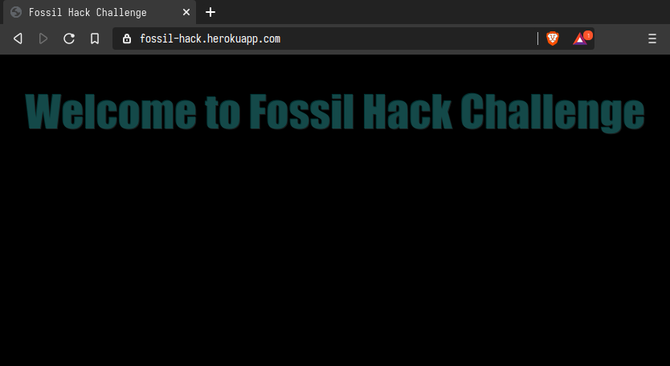
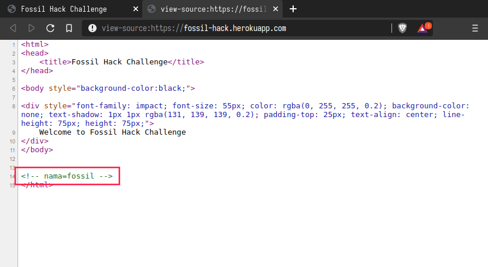
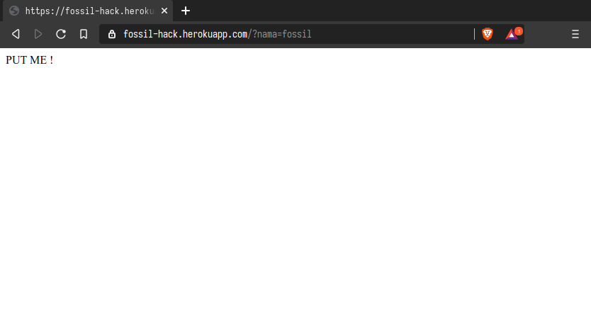
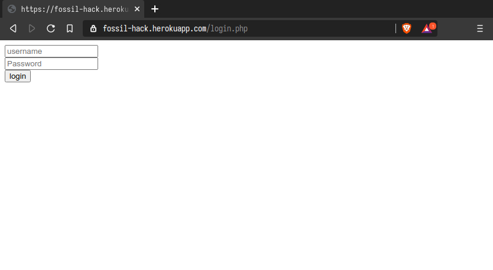
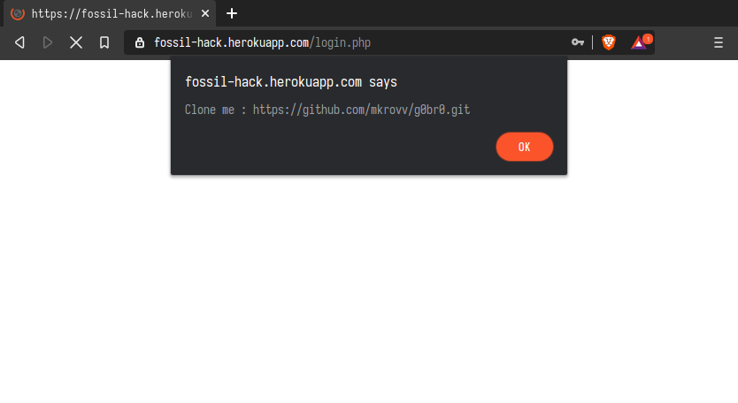
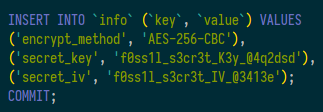
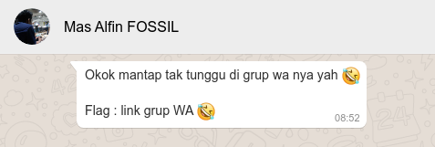

# Writeup Fossil Hack Challenges

Fossil Hack Challeges ini adalah game CTF (Capture The Flag) yang dibuat oleh [Alfin Andika Pratama](https://github.com/Alfinandika) Ketua Fossil 2019/2020. Untuk link Challenges nya bisa dilihat [disini](https://fossil-hack.herokuapp.com/). 

Untuk challenge ini menurut saya mudah dan sangat merekomendasikan untuk dipelajari. Pada kesempatan kali ini kita akan sama-sama untuk mengerjakan challenge ini. Untuk mengerjakan challenge ini tidak diperlukan tool khusus kalian dapat menggunakan :
- Browser
- Text Editor
- Curl / Postman
- Git

Oke jika alat perang sudah lengkap langsung saja kita mulai mengerjakan challenge ini :)


## Welcome to Fossil Hack Challenge




Sekilas tidak ada yang aneh pada halaman web dan tidak kita temukan clue apapun. Untuk itu kita coba cara klasik yaitu dengan cara view-source(Melihat source code HTML) umumnya bisa menggunakan `ctrl+u` atau bisa juga dengan cara melakukan inspect elemen.



Nah kan kok ada komentar aneh di source code html nya. Semoga aja ini adalah sebuah clue awal yang akan mengantarkan kita menuju flag-nya :). Sepertinya ini adalah sebuah parameter web untuk itu kita coba saja dengan mengirimkan paramater tersebut `https://fossil-hack.herokuapp.com/?nama=fossil`. 



Setelah kita akses url nya dengan mengirimkan parameter tersebut muncul halaman dengan konten `PUT ME`. Ini pasti tidak jauh jauh dari sebuah HTTP Request Methods untuk lebih jelasnya mengenai jenis dan pengertian HTTP Request Method bisa dilihat [disini](https://developer.mozilla.org/id/docs/Web/HTTP/Methods).

```bash
$ curl --location --request PUT 'https://fossil-hack.herokuapp.com/?nama=fossil'
{"message":"Congratulations! You solved the first challenge","next_challenge":"cGF0Y2ggbWUgb24gaHR0cC5waHA="}
```

Karena itu pasti sudah jelas merupakan HTTP Request Methods langsung kita sikat saja dengan bantuan tool `CURL`. Sampai disini Challenge pertama sudah solved. Sekarang Lanjut..... 


```bash
$ echo cGF0Y2ggbWUgb24gaHR0cC5waHA= | base64 -d
patch me on http.php
```

Pada flag chall pertama sudah ada clue untuk chall selanjutnya namun diencode dengan base64 :( tidak masalah tinggal kita decode aja dan cilub ba.... hore clue lagi nih :).


```bash
$ curl --location --request PATCH 'https://fossil-hack.herokuapp.com/http.php'
{"username":"f0ss1l","password":"a837605c2eed285bd5c724ce76323264"}
```

PATCH juga termasuk dalam salah satu HTTP Request Method untuk langkah selanjutnya kita diminta untuk `patch` pada `http.php` kita lakuin aja apa yang dia mau dan boom... kita mendapatkan sebuah username dan password. Tapi login nya dimana ya :( ?




Saatnya menggunakan aji aji tebak tebakan dan logika :) karena tadi ada suatu file dengan nama `http.php` maka kemungkinan nama halaman login nya tidak jauh dengan ekstensi php. Disini kita langsung coba akses saja ke `https://fossil-hack.herokuapp.com/login.php`. Silakan login dengan Username dan Password yang sudah kita dapatkan :)



Setalah mencoba login muncul sebuah alert dengan pesan yang menyuruh kita untuk clone sebuah repository github. `https://github.com/mkrovv/g0br0.git`


```bash
$ git clone https://github.com/mkrovv/g0br0.git
Cloning into 'g0br0'...
remote: Enumerating objects: 8, done.
remote: Counting objects: 100% (8/8), done.
remote: Compressing objects: 100% (6/6), done.
remote: Total 8 (delta 0), reused 8 (delta 0), pack-reused 0
Unpacking objects: 100% (8/8), 2.76 KiB | 943.00 KiB/s, done.
$ cd g0br0/
$ ls -l
total 4
-rw-r--r-- 1 yanuarakhid users 15 Jun 27 19:21 readme.txt
$ cat readme.txt
lanjutkan bro !
```

Ternyata hanya ada sebuah file `readme.txt` saja dengan pesan `lanjutkan bro !` sungguh terlalu masa iya itu flagnya tidak mungkin sekali :(

```bash
$ git branch -a | grep -v ‘remotes’
* master
  remotes/origin/HEAD -> origin/master
  remotes/origin/master
  remotes/origin/way
$ git checkout way
Branch 'way' set up to track remote branch 'way' from 'origin'.
Switched to a new branch 'way'
$ ls
credentials.sql  crypt.php  readme.txt  text.txt
$
```

Tapi jangan nyerah dulu kita cek dulu apakah ada branch lain pada repository ini. Ternyata ada sebuah branch dengan nama `way` langsung saja kita switch ke branch tersebut dan tara..... ada apaan tuh heheheh 😆

```bash
$ tree
.
├── credentials.sql
├── crypt.php
├── readme.txt
└── text.txt

0 directories, 4 files
$ cat crypt.php 
<?php

function encrypt($string)
    {
        $output = false;
        $encrypt_method = "";
        $secret_key = "";
        $secret_iv = "";
        // hash
        $key = hash('sha256', $secret_key);
        // iv - encrypt method ### expects 16 bytes
        $iv = substr(hash('sha256', $secret_iv), 0, 16);

        $output = openssl_encrypt($string, $encrypt_method, $key, 0, $iv);
        $output = base64_encode($output);

        return $output;
    }

$plaintext = "";

echo encrypt($plaintext);
?>

```

Sepertinya kita diberikan suatu file enkripsi yang dibuat dengan PHP yang hasil output dari enkripsi tersebut diencode dengan base64 lengkap dengan hasil enkripsi nya yang sepertinya ini adalah flagnya.



pada file `credentials.sql` juga ada informasi mengenai enkripsi method dan secret key yang kemungkinan ini digunanakan untuk mengenkripsi flagnya.

```bash
$ cat text.txt
V2hwNTdTNEhhOGRiT0MrZ2tVaUFjcmVqL0ozY2FRc2VBWTNRckV0RnVPVWdvNlA0eFlpdWNsYUp0VS85WDFKU0Ixc3Z6UEhCaTdqQUIzdERkTElkZHc9PQ==
$
```

karena tadi kita sudah menganalisa bahwa hasil enkripsi diencode menggunakan base64 maka pada file `text.txt` ada suatu string yang sudah pasti ini adalah flag. Mari kita selesaikan.....

```bash
$ cat dec.php
<?php

function dec($string)
    {
        $encrypt_method = "AES-256-CBC";
        $secret_key = "f0ss1l_s3cr3t_K3y_@4q2dsd";
        $secret_iv = "f0ss1l_s3cr3t_IV_@3413e";
        $key = hash('sha256', $secret_key);
        $iv = substr(hash('sha256', $secret_iv), 0, 16);
        $output = base64_decode($string);
        $output = openssl_decrypt($output, $encrypt_method, $key, 0, $iv);
        return $output;
    }

$dekrip = "V2hwNTdTNEhhOGRiT0MrZ2tVaUFjcmVqL0ozY2FRc2VBWTNRckV0RnVPVWdvNlA0eFlpdWNsYUp0VS85WDFKU0Ixc3Z6UEhCaTdqQUIzdERkTElkZHc9PQ==";

echo dec($dekrip);
?>
$ php dec.php
https://chat.whatsapp.com/FLAGDISENSOR
```


Langkah terakhir untuk mendapatkan flagnya adalah kita cukup meracik script php, kita tinggal balik saja logika nya dengan cara memasukan informasi-informasi yang kita dapat untuk mendekripsi flagnya dan BOOM.... ternyata flag akhirnya adalah menuju sebuah link invite group whatshapp sesuai dengan yang dikatan si pembuat soal. **Terimakasih dan Selamat mencoba :)**


**Salam OpenSource 🐧**


### Referensi
- [https://id.wikipedia.org/wiki/CURL](https://id.wikipedia.org/wiki/CURL)
- [https://developer.mozilla.org/id/docs/Web/HTTP/Methods](https://developer.mozilla.org/id/docs/Web/HTTP/Methods)
- [PHP](https://id.wikipedia.org/wiki/PHP)
- [Belajar GIT & GITHUB](https://www.youtube.com/playlist?list=PLFIM0718LjIVknj6sgsSceMqlq242-jNf)
- [Belajar API](https://www.youtube.com/playlist?list=PLFIM0718LjIW7AsIbnhFg15t9yx4H-sQ0)
- [Belajar PHP](https://www.youtube.com/playlist?list=PLFIM0718LjIUqXfmEIBE3-uzERZPh3vp6)

**Akhid Yanuar A.F**    
R&D Staff 
[GitHub](https://github.com/yanuarakhid) | [LinkedIn](https://linkedin.com/in/yanuarakhid)